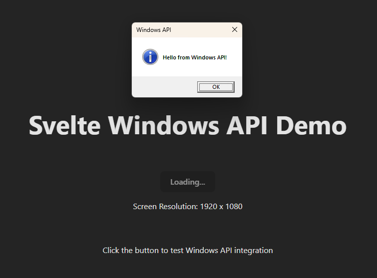

# Svelte for Windows

A modern desktop application built with Svelte and TypeScript that interfaces with Windows APIs. This application provides a bridge between web technologies and native Windows functionality.



## Features

- Built with Svelte 5 and TypeScript for a modern, type-safe development experience
- Native Windows API integration using FFI (Foreign Function Interface)
- WebSocket-based communication between frontend and backend
- Hono-powered backend server for handling API requests
- Runtime type checking and validation using Zod with Hono middleware
- Real-time updates and event handling

## ⚠️ Security Notice

This application opens local ports for communication:

- Port 5173 for the Vite development server (frontend)
- Port 3000 for the WebSocket server (backend)

**Security Implications:**

- WebSocket server exposes partial Windows API access
- Restrict ports to localhost only through firewall settings
- Implement secure client-server authentication

## Prerequisites

- Node.js v22 or later
- Windows 10 or later
- Git

## Project Structure

```
├── src/
│   ├── lib/
│   │   ├── api.ts        # API interface definitions
│   │   ├── client.ts     # WebSocket client implementation
│   │   └── winapi.ts     # Windows API integrations
│   ├── App.svelte        # Main application component
│   ├── app.css          # Global styles
│   ├── main.ts          # Application entry point
│   ├── server.ts        # Backend server implementation
│   └── vite-env.d.ts    # Vite environment types
├── .github/             # GitHub configuration and assets
├── .vscode/            # VS Code configuration
├── dist/               # Build output directory
├── public/             # Optional public static files
├── index.html          # HTML entry point
├── package.json        # Project dependencies and scripts
├── svelte.config.js    # Svelte configuration
├── tsconfig.json       # Base TypeScript configuration
├── tsconfig.app.json   # Frontend TypeScript configuration
├── tsconfig.node.json  # Vite/Node TypeScript configuration
├── tsconfig.server.json # Backend TypeScript configuration
├── vite.config.ts      # Vite build configuration
└── README.md          # Project documentation
```

## Getting Started

1. Clone the repository:

   ```bash
   git clone https://github.com/Filyus/Svelte-for-Windows.git
   cd svelte-for-windows
   ```
2. Install dependencies:

   ```bash
   npm install
   ```
3. Start the development server:

   ```bash
   npm run dev
   ```

This will concurrently run the Vite development server for the frontend and the TypeScript backend server.

## Scripts

- `npm run dev` - Start development servers (frontend + backend) concurrently
- `npm run dev:client` - Start Vite development server for frontend only
- `npm run dev:server` - Start TypeScript backend server with hot reload
- `npm run build` - Build both client and server for production
- `npm run build:client` - Build frontend only to dist/client
- `npm run build:server` - Build backend server using TypeScript
- `npm run preview` - Preview the production build (both client and server)
- `npm run check` - Run TypeScript and Svelte checks
- `npm run clean` - Remove the dist directory

## Technology Stack

- **Frontend**: Svelte 5, TypeScript
- **Backend**: Node.js, Hono
- **Communication**: WebSocket (ws)
- **Windows Integration**: FFI-RS
- **Build Tools**: Vite, TSX

## Development

This project uses TypeScript for type safety and better developer experience. The codebase is structured to separate concerns between frontend components, backend services, and Windows API integrations.

## Contributing

Contributions are welcome! Please feel free to submit a Pull Request.

## License

MIT License

Copyright (c) 2024 Filyus

Permission is hereby granted, free of charge, to any person obtaining a copy of this software and associated documentation files (the "Software"), to deal in the Software without restriction, including without limitation the rights to use, copy, modify, merge, publish, distribute, sublicense, and/or sell copies of the Software, and to permit persons to whom the Software is furnished to do so, subject to the following conditions:

The above copyright notice and this permission notice shall be included in all copies or substantial portions of the Software.

THE SOFTWARE IS PROVIDED "AS IS", WITHOUT WARRANTY OF ANY KIND, EXPRESS OR IMPLIED, INCLUDING BUT NOT LIMITED TO THE WARRANTIES OF MERCHANTABILITY, FITNESS FOR A PARTICULAR PURPOSE AND NONINFRINGEMENT. IN NO EVENT SHALL THE AUTHORS OR COPYRIGHT HOLDERS BE LIABLE FOR ANY CLAIM, DAMAGES OR OTHER LIABILITY, WHETHER IN AN ACTION OF CONTRACT, TORT OR OTHERWISE, ARISING FROM, OUT OF OR IN CONNECTION WITH THE SOFTWARE OR THE USE OR OTHER DEALINGS IN THE SOFTWARE.
